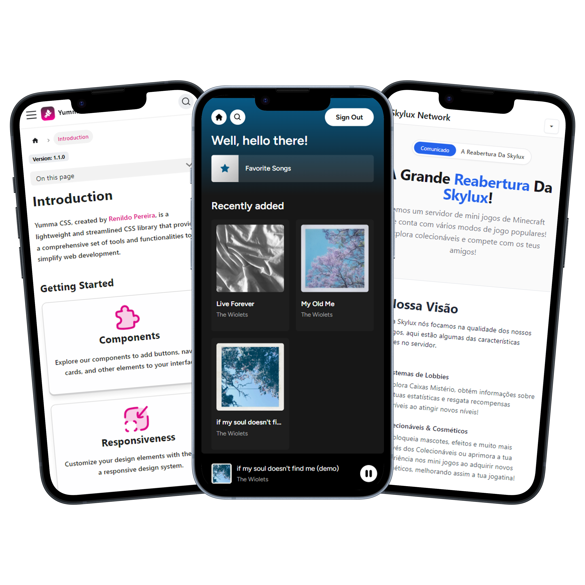

  

<h3 align="center">Renildo Pereira</h3>

  I'm a Full-Stack developer with over 2 years of experience working as a freelancer.
   
  <a href="https://rrenildopereiraa.github.io/renildo/" target="_blank" rel="noopener"><strong>Want to see my portfolio? ↝</strong></a>
   
   

 ---

  <h3>My projects</h3>
  
Here it is some of my recent projects I've been working on. Follow me on <a href="https://www.linkedin.com/in/rrenildopereiraa/">Linked In</a> where I post updates about my current projects and more.

  <a href="https://yummacss.com">Yumma CSS</a>
    •
    <a href="https://vipercel.vercel.app/">Vipercel</a>
    •
    <a href="https://skyluxmc.vercel.app.">Skylux Blog</a>

  

